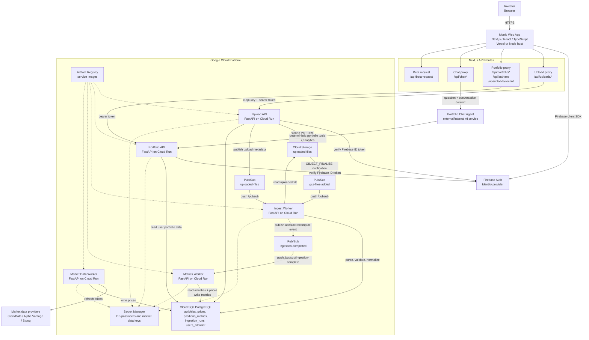
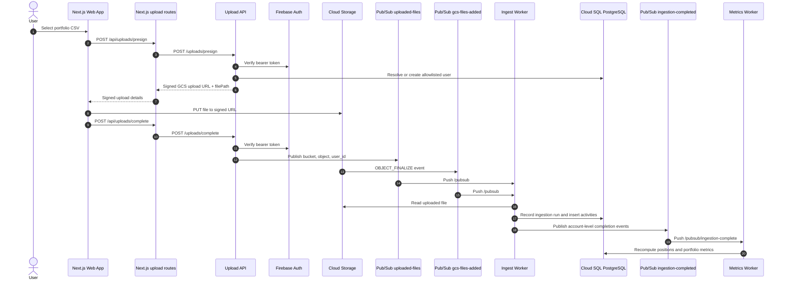
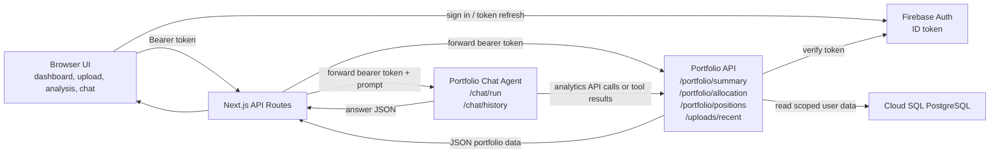

# Moniq Web App Architecture

This document is editable Markdown. The diagrams use Mermaid, so they can be changed directly in this file or pasted into https://mermaid.live.

## System Context

## Upload And Processing Flow

## Dashboard And Chat Flow

## Primary Code Owners

| Area | Repository path |
| --- | --- |
| Web app pages | `app/*/page.tsx` |
| Shared UI | `components/` |
| Next.js API proxies | `app/api/**/route.ts` |
| Firebase client auth | `lib/firebaseClient.ts` |
| Upload service | `services/upload-api/` |
| Portfolio read API | `services/portfolio-api/` |
| Ingestion worker | `services/ingest-worker/` |
| Metrics worker | `services/metrics-worker/` |
| Market data worker | `services/market-data-worker/` |
| Database schema | `db/migrations/` |
| GCP infrastructure | `infra/terraform/` |

## Notes

- The web app is intentionally thin: browser pages call local Next.js API routes, and those routes proxy to backend services using environment variables such as `UPLOAD_API_URL`, `PORTFOLIO_API_URL`, and `CHAT_AGENT_URL`.
- Firebase ID tokens are verified by the Upload API and Portfolio API. Allowlist checks are backed by `users_allowlist` in PostgreSQL.
- Upload completion currently publishes an explicit `uploaded-files` event, while Cloud Storage also emits `OBJECT_FINALIZE` events to `gcs-files-added`. Both are wired to the ingest worker in Terraform.
- Portfolio metrics are recomputed after successful ingestion through the `ingestion-completed` Pub/Sub topic.
